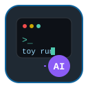
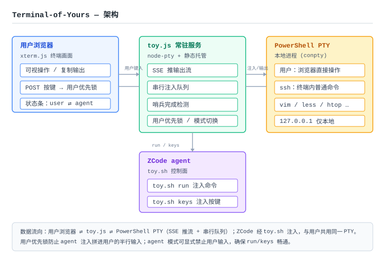

<p align="center">
  
</p>

<h1 align="center">Terminal-of-Yours (TOY)</h1>

<p align="center">
  用户浏览器与 AI agent <b>协同控制同一个本地终端</b> · 所见即所得（原生支持 Linux / UOS / Windows）
</p>

<p align="center">
  
  
  
  
  
</p>

<p align="center">
  🇨🇳 中文 &nbsp;|&nbsp; 🇬🇧 <a href="README.en.md">English</a>
</p>

---

用户在浏览器里开一个终端干活，AI agent 能往同一个终端注入命令、注入按键、实时看到输出——
双方共用同一画面、同一份 context。需要操作远端时，在终端里 `ssh` 即可，注入自然流经 ssh 到达远端。

## 特性

- **协同终端画面** — 用户浏览器（xterm.js）与 agent（ZCode）共用一个本地 PTY，命令与输出所见即所得
- **`toy.sh run` 注入命令** — agent 注入命令并等待完成，返回 `{status, output, exitCode}`
- **`toy.sh keys` 按键注入** — 面向 vim / ssh / less 等全屏交互程序，原样写入按键序列
- **用户优先锁** — 用户在浏览器输入即置锁，避免 agent 注入拼进半行输入（冲突避免，非权限审批）
- **操作权切换** — `user ⇄ agent` 模式一键切换：agent 模式显式禁止用户输入，确保注入畅通
- **串行注入队列** — 用户按键与 agent 命令经同一队列，修复并发乱序硬伤
- **哨兵完成检测** — 注入令牌回显天然区分 PSReadLine 与真实输出，可靠判定命令结束
- **断线回放** — 重连即清屏 + 全量回放缓冲（默认 512KB），切实时流
- **零额外依赖** — 唯一 npm 依赖 `node-pty`（prebuilt 免编译）；HTTP/SSE 用 Node 原生，无 WebSocket
- **本地安全** — 仅绑定 `127.0.0.1` 并校验 Host/Origin，浏览器页面等同本地终端

## 架构



```
浏览器 xterm.js ←SSE→ toy.js(node-pty + 静态托管) ←toy.sh→ ZCode
     ↕ POST 按键(用户优先锁)      ↕ 串行注入队列/哨兵
              本地 Shell PTY（Linux: bash/zsh · Windows: PowerShell）
                ├─ 用户：直接在浏览器终端操作
                └─ ssh：终端里的普通命令（连任意远端）
```

## 安装与配置

### 前置条件清单

- [ ] **系统**：Windows 10/11（node-pty 依赖 ConPTY，Win 7/8 不支持）或 **Linux / macOS（UOS v20 等原生支持）**
- [ ] **Git Bash**（Windows 需 MSYS2/Git Bash；Linux/macOS 用系统自带 bash 即可，`toy.sh` 是 bash 脚本）
- [ ] **Node.js 18–24**（node-pty 1.1.0 prebuild 实测兼容 18–24，`package.json` 已声明 `engines`）
- [ ] **Shell**：Windows 默认 PowerShell 5.1/7；**Linux/macOS 默认用户登录 shell（bash/zsh，原生 Linux 终端）**

> Linux 首次 `npm install` 若 node-pty 无匹配 prebuild，需本地编译链：
> `sudo apt-get install -y build-essential python3`（UOS/Debian 系）

不确定环境时先跑 `bash scripts/toy.sh doctor` 自检，全绿再安装。

### 一键安装（推荐）

```bash
git clone https://github.com/qwerd53/terminal-of-yours.git TerminalOfYours
cd TerminalOfYours
bash scripts/install.sh          # 环境自检 + 自动 npm install node-pty
bash scripts/toy.sh start        # 启动服务并自动打开浏览器
```

- `install.sh` 自检失败会给出明确修复提示（如 Node 版本不匹配时建议用 nvm 切换 18–24）
- 依赖安装失败时提示两条解决路径：node-pty prebuilt 换 Node 版本 / 本地编译链（python + node-gyp + VS Build Tools）

### 注册为 agent skill

`install.sh --link [目标目录]` 一键注册（优先软链；Windows 下软链失败自动 fallback 拷贝）：

```bash
bash scripts/install.sh --link ~/.claude/skills/terminal-of-yours
```

- 目标目录需含 `SKILL.md`（agent 按 skill 目录识别）；frontmatter 无需修改
- 常见目录：`~/.claude/skills/`、`~/.zcode/skills/`、`~/.agents/skills/`（默认 `~/.workbuddy/skills/`）
- 不注册也能用：直接 `bash scripts/toy.sh start` 本机试用

### 传统方式（拷贝目录 / 免 install）

本 skill 唯一运行时依赖是 `node-pty`（prebuilt，免编译）。两种方式都能跑起来：

**方式 A — 原始仓库 / 首次克隆（零手动步骤）**

`toy.sh start` 是**幂等**的：脚本检测到 `server/node_modules/node-pty` 不存在时会**自动执行 `npm install`**，无需你手动装。

**方式 B — 副本 / 拷贝目录**

把整个 `TerminalOfYours/` 目录复制走后，有两种启动姿势：

1. **让脚本自动装**（最省事）：直接 `bash scripts/toy.sh start`，首次会自动 `npm install node-pty`。
2. **手动先装**（你的习惯）：

```bash
cd server && npm install node-pty && cd ..
bash scripts/toy.sh start
```

> 注意：`toy.sh` 通过 `BASH_SOURCE` 自定位到脚本所在目录，**不依赖你当前所在的 cwd**——在副本里任意位置执行都行。唯一前提是副本里保留 `server/`、`scripts/`、`web/` 三者完整。

### PowerShell 7 支持

- 默认 `shell=auto`：优先 `pwsh`（PS7，含常见安装路径 `C:\Program Files\PowerShell\7\pwsh.exe`），找不到回退 `powershell.exe`（PS5.1）
- 显式覆盖：`runtime/config.txt` 写 `shell=pwsh` 或 `shell=powershell.exe`
- `toy.sh status` 返回 `shell`（**解析后的实际 shell 路径**）与 `shellVersion`（`5` / `7` / `null`=探测失败）
- PS7 下 `run` 支持 `&&` / `??` / 三元表达式；PS5.1 仍需单行分号合并——agent 依据 `shellVersion` 判断语法规则

## 快速开始

```bash
bash scripts/toy.sh start      # 启动服务并自动打开浏览器（TOY_NO_OPEN=1 不弹窗）
bash scripts/toy.sh run 'git status'          # agent 注入命令（返回 {status,output,exitCode}）
bash scripts/toy.sh keys '\x03'               # 注入 Ctrl-C（交互模式/打断卡死）
bash scripts/toy.sh status                    # 状态查询
bash scripts/toy.sh stop                      # 停止服务
```

## 命令参考

| 命令 | 说明 |
| --- | --- |
| `toy.sh start` | 幂等拉起常驻服务（首次自动 `npm install node-pty`），成功后自动打开浏览器（`TOY_NO_OPEN=1` 关闭）。端口见 `runtime/toy.port`（默认 8787，被占自动 +1） |
| `toy.sh status` | 返回 JSON：会话存活、用户锁状态、排队数、端口、shell 等 |
| `toy.sh stop` | 停止服务（终端会话随服务停止） |
| `toy.sh run '<命令>' [超时秒]` | agent 注入命令并等待完成，默认超时 120s，返回 `{status,output,exitCode}` |
| `toy.sh keys '<按键序列>'` | 交互模式按键注入（无哨兵），用于 vim/ssh/less 等，支持 `\x03 \e \r \n \t` 转义 |
| `toy.sh mode [user\|agent]` | 查看或切换操作权；`agent` 模式禁止用户输入，确保注入畅通 |
| `toy.sh pause` | agent 侧手动置用户优先锁（发现用户正在操作） |
| `toy.sh resume` | 清锁。由 agent 平台调用：收到 `paused` 后确认用户 → `resume` 再重跑同一命令 |
| `toy.sh url` | 打印浏览器地址 |
| `toy.sh kill-session` | 销毁当前终端会话（进程树），agent 的 run/keys 全部失效 |
| `toy.sh doctor` | 环境自检（bash/node/shell/依赖），复用 `install.sh --check-only` |

### `run` 返回状态码

| status | 含义 |
| --- | --- |
| `done` | 命令完成，`exitCode` 为退出码（仅 native 命令有效，cmdlet 后为残留值） |
| `timeout` | 超过超时未完成，命令仍在终端里继续跑 |
| `paused` | **立即返回**，未执行。用户在浏览器输入触发了用户优先锁 —— 确认后 `resume` 再重跑 |
| `exited` | 终端会话已结束（用户敲了 exit 或 kill-session） |

> 页面**没有「放行/丢弃」按钮**了——恢复与否由 agent 平台（对话）决策，TOY 只报告 `paused` 状态。

## 使用规则（agent 必读）

1. **勿并发 run** —— 注入队列串行，一条命令完成前不要发下一条
2. **按 shellVersion 选语法** —— run 前先查 `toy.sh status` 的 `shellVersion`：为 `7` 时允许 `&&`/`??`/三元表达式；为 `5` 或 `null` 时仍需 5.1 兼容、单行分号合并（无 `&&`、`??`、三元；多行用分号合并成单行）
3. **不假设 conda 已激活** —— 需要时显式 `conda activate <env>`
4. **全屏交互程序内禁止 run 注入** —— 用 `keys` 注入按键；退出用 `keys '\x03'` 或退出序列
5. **输出含回显** —— `output` 是终端流（含命令回显、提示符、ANSI 序列），解析时注意
6. **exit code 语义** —— `$LASTEXITCODE` 仅 native 命令后更新；要可靠退出码用 `cmd /c '...'` 包装
7. **run 被 paused 时** —— 命令未执行，立即返回；在对话中向用户确认，用户同意后 `resume` 再重跑
8. **会话重建** —— kill-session / 服务停止后会话状态丢失，agent 依赖自身对话历史重新确认状态
9. **多标签接管** —— 任何标签输入即自动接管（只读镜像其余标签）；agent 的 run/keys 始终可用
10. **安全** —— 仅绑定 127.0.0.1 且校验 Host/Origin；页面可执行任意本地命令，勿暴露到局域网

## 目录

```
├── SKILL.md          # agent 协议文档（含 frontmatter 元数据）
├── README.md         # 本文件
├── assets/           # icon.svg / architecture.svg 自包含矢量图
├── scripts/toy.sh    # 管理命令
├── scripts/install.sh# 一键安装/环境自检（--check-only 供 toy.sh doctor 复用）
├── server/           # toy.js 常驻服务（node-pty 唯一依赖）
├── web/              # index.html + app.js + vendor/（@xterm/xterm 本地化）
└── runtime/          # config.txt（参考 config.example.txt）/ toy.pid / toy.port / toy.log（10MB×3 轮转，脱敏）
```

## 边界与已知限制（一期）

- **单用户单 agent** —— 多浏览器标签只有首连可输入；无鉴权（仅绑定 127.0.0.1 + Host/Origin 校验）
- **Shell 判定按 `status.kind`** —— `status.kind` 为 `powershell`（Windows）或 `posix`（Linux/macOS，bash/zsh/fish 原生终端）。posix 下 agent 按 bash 语法（`&&`、`||`、哨兵用 `$?`）；`status.shellVersion` 为主版本号（bash 5 / zsh 5 等）。exit code 仅 native 命令可靠
- **交互程序内禁止 run 注入** —— vim/ssh/less 内用 `keys` 注入
- **不跨重启持久** —— 机器重启 / stop 后会话丢失（agent 对话历史记忆兜底）；kill-session 后 `start` 自动重建
- **输出含回显与 ANSI 序列** —— `output` 是终端流，解析时注意

## 设计过程

本 skill 经 grilling 设计树（20+ 决策）+ 子 agent 技术审查（13 项修正）后实现，关键坑记录：

- `$LASTEXITCODE__` 变量吞并 bug（下划线属变量名）→ 花括号 + `[int]` 强制（PowerShell 分支）
- node-pty 在 Node 22 下 PTY 退出后 resize 崩溃 → 全部 try/catch
- PSReadLine/readline 半行输入与注入拼接 → 注入前置 `\x03` 清行
- Windows 浏览器自动打开 → `cmd //c start "" "URL"`；Linux → `xdg-open`
- POSIX 哨兵：bash/zsh 用 `echo "..._$?__"` 携带上一条命令退出码，regex 只匹配数字结尾，天然区分 readline 回显与真实输出

---

<p align="center">
  <sub>Terminal-of-Yours · 让 agent 与用户共享一个真实终端 · MIT License</sub>
</p>
